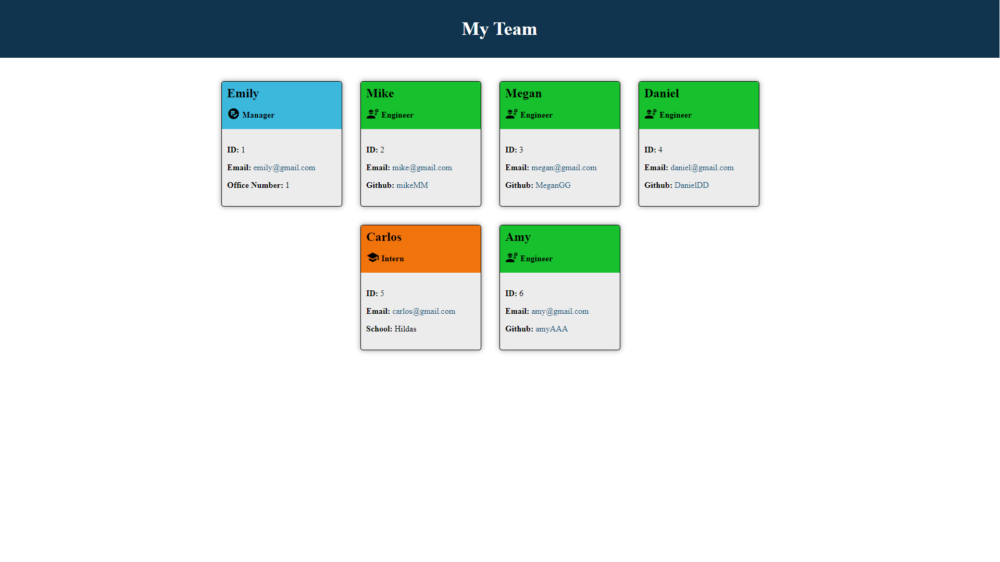

# Team Profile Generator

## Table Of Contents
  - [Description](#description)
  - [Installation](#installation)
  - [Usage](#usage)
  - [Test](#test)
  - [Questions](#questions)

## Description
This app allows the user to create their own team.



The app allows the user to enter 3 different proflies (manager, engineer and intern) and fill out a few questions to display their name, Id, email, github and school.

## Installation
Package required: </br>
- Inquirer
- Jest
```bash
npm i
```

## Usage
To run the app enter the following command on the terminal:
```bash
node index.js
```
After that you will be able to answer a few question to complete your tem and generate the html.</br>

## Test
Run the following command to run the test for this app:
```bash
npm run test
```

## Questions
If you have any questions you can find me in: </br>
GitHub: https://github.com/GrilloGG </br>
Email: grillo.garnacho@gmail.com
